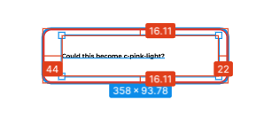

<!-- section-title: 1- Problem -->

# Problem

- It's hard to implement pixel perfect figma designs! 

example: 

<!-- note
Oftens there is a lot of back and forth and missed details to make things pixel perfect
Bellatrix and I met at the end of last year to see how we could improve this process
-->
